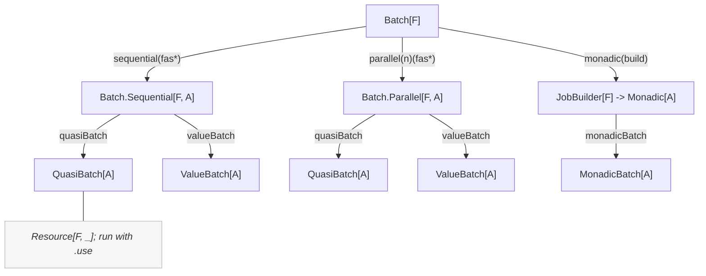
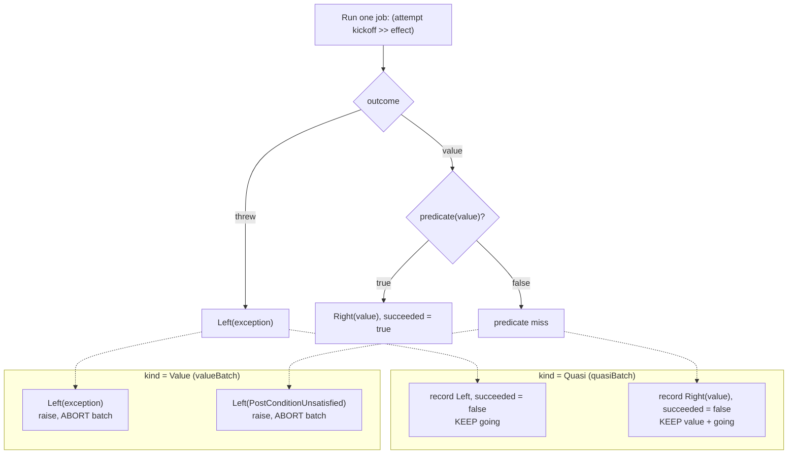
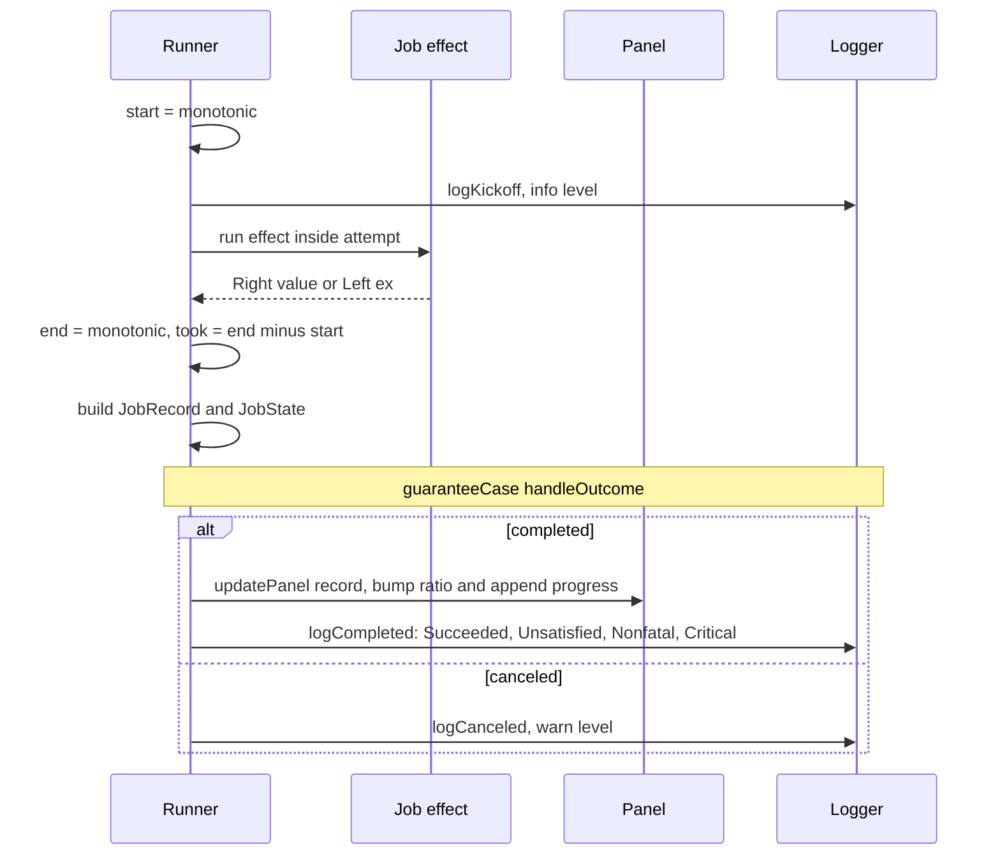
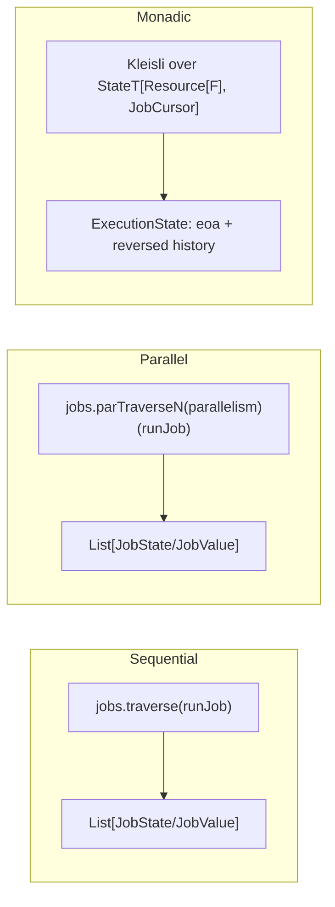
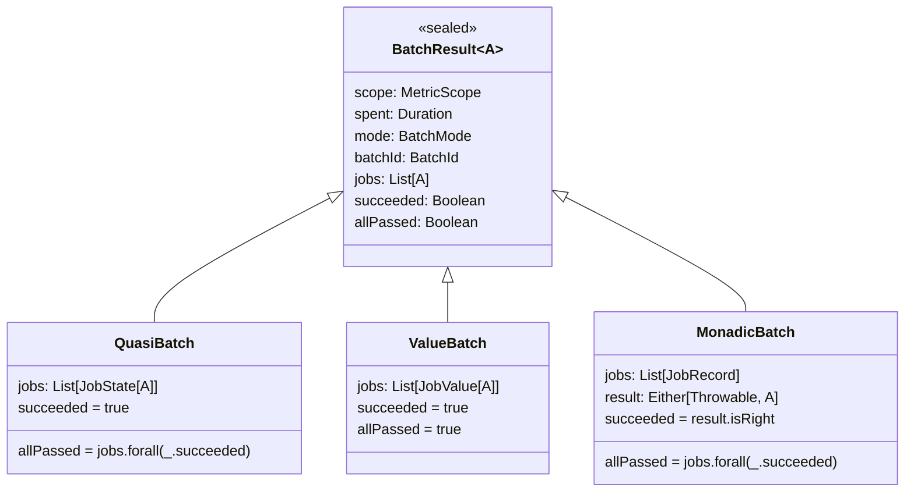

# Batch execution

The `batch` package runs a group of named jobs under a shared metric scope, records per-job
timing and outcomes, and produces a single aggregate `BatchResult`. This document describes how
the pieces fit together.

## Entry points

`Batch[F]` is the façade. From it you pick one of three execution shapes, then choose how failures
are handled.

- **Sequential / Parallel** — independent jobs. `quasiBatch` collects every outcome (failures
  included); `valueBatch` propagates the first failure and keeps only successful values.
- **Monadic** — later jobs depend on earlier results, composed with `map`/`flatMap`. Produces a
  `MonadicBatch` carrying the step history and the final `Either`.

All of `quasiBatch`, `valueBatch`, and `monadicBatch` return a `Resource[F, _]`; the batch runs
when the resource is used, and the active gauge / writers are released on close.

## The two failure models

The `BatchKind` on each job decides what a failure means. This is the core distinction between
`quasiBatch` and `valueBatch`.

So:

- **Quasi** always runs to completion. `succeeded` on the result is always `true`; `allPassed`
  is `false` if any job threw or was rejected by its predicate.
- **Value** stops at the first failing or rejected job by raising, so a `ValueBatch` only ever
  exists when every retained job succeeded (`succeeded` and `allPassed` are both `true`).

## Per-job lifecycle

Every tracked job (sequential, parallel, or monadic) runs through the same steps. Timing brackets
the kickoff log plus the effect; the completion log is written after `end` and is not part of
`took`.

`handleOutcome` runs in a finalizer (`guaranteeCase`), so progress and completion logging happen
even on cancellation. `Outcome.Errored` is treated as impossible because the kickoff and effect
are wrapped in `attempt`.

## How the three modes differ

- **Sequential** threads jobs with `traverse`; **Parallel** with `parTraverseN`. Both time the
  whole traversal (`spent`) and build the result from the collected `JobState`/`JobValue` list.
- **Monadic** threads a `JobCursor` (running index + carry-over start time) through a
  `StateT`/`Kleisli`, so each job's `start` is the previous job's `end`. Its `took` therefore
  absorbs any invisible `untracked`/`pure` steps between jobs, and the per-job durations sum
  exactly to `spent`. A `Left` short-circuits the remaining chain; `withFilter` turns a rejected
  value into a `PostConditionUnsatisfied` `Left`.

## Result types

- `succeeded` — did the batch operation itself complete? Quasi and Value always do; Monadic
  completes only when its chain is not short-circuited.
- `allPassed` — did every job satisfy its post-condition? Can be `false` even when `succeeded`
  is `true` (a completed quasi/monadic batch with some rejected jobs).

See `../src/main/scala/com/github/chenharryhua/nanjin/guard/batch/data.scala` for the result and job types, and `internal.scala` for `ExecutionState`,
`JobCursor`, and the log-entry classification.
