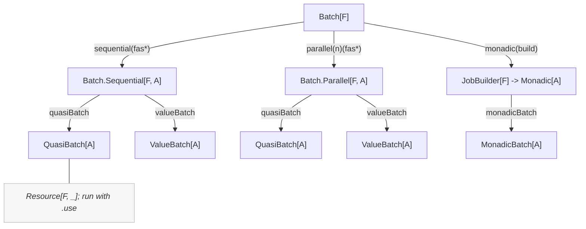
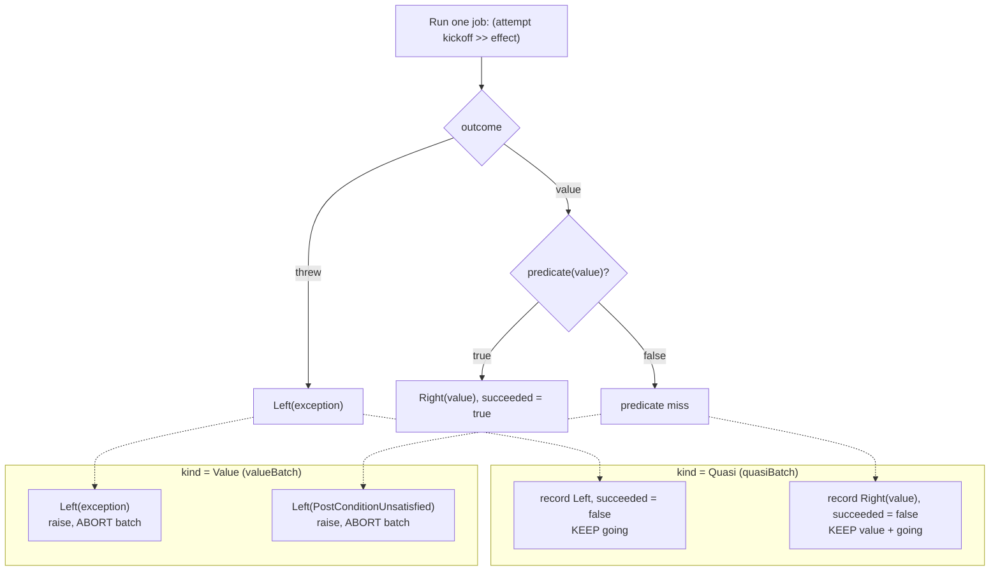
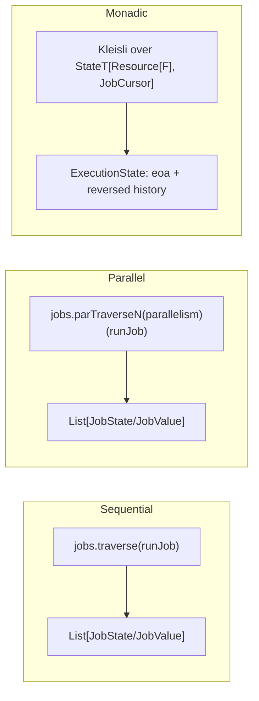
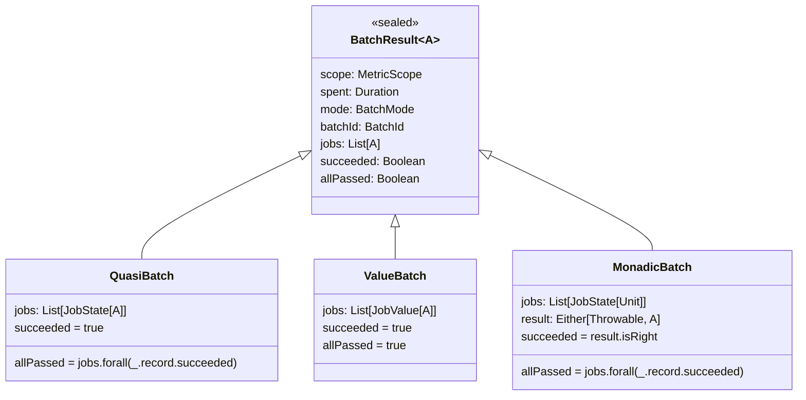
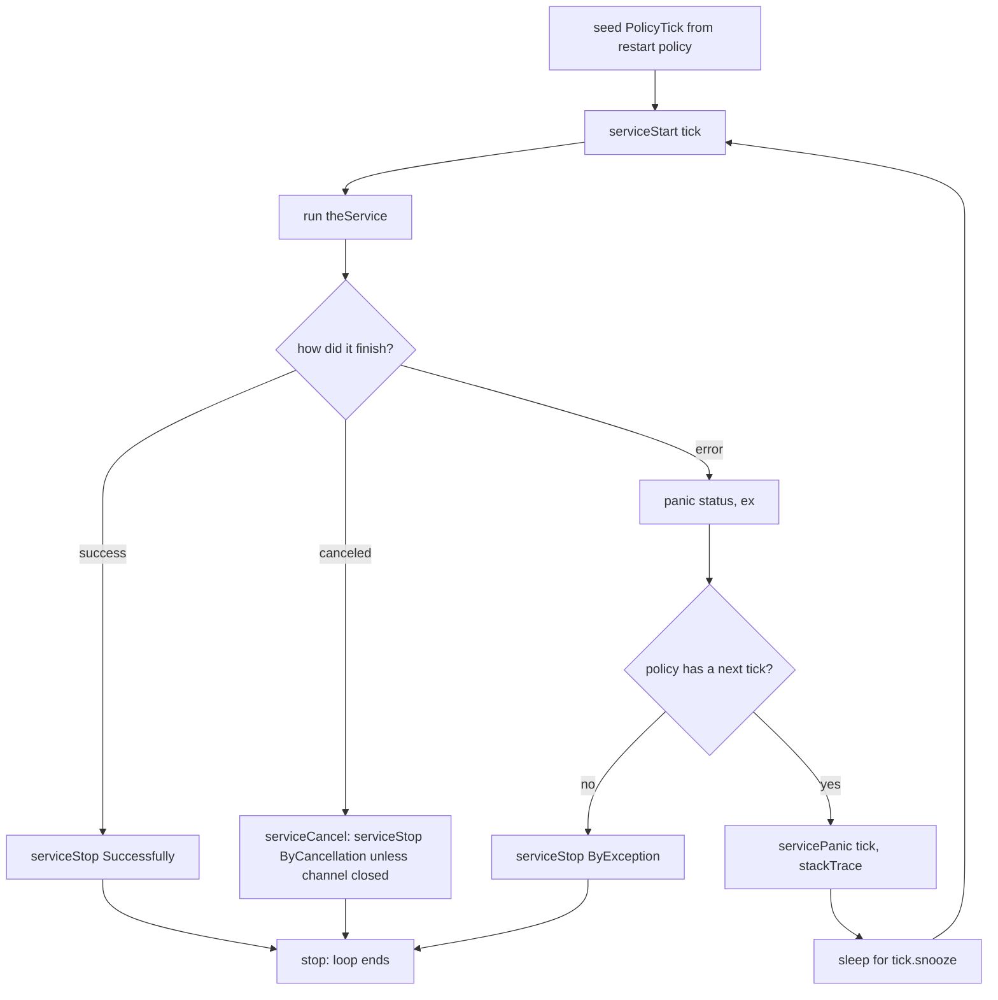
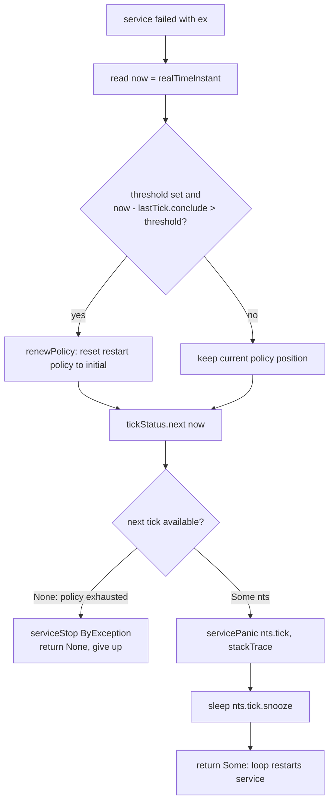

# Batch execution

The `batch` package runs a group of named jobs under a shared metric scope, records per-job
timing and outcomes, and produces a single aggregate `BatchResult`. This document describes how
the pieces fit together.

## Entry points

`Batch[F]` is the façade. From it you pick one of three execution shapes, then choose how failures
are handled.



- **Sequential / Parallel** — independent jobs. `quasiBatch` collects every outcome (failures
  included); `valueBatch` propagates the first failure and keeps only successful values.
- **Monadic** — later jobs depend on earlier results, composed with `map`/`flatMap`. Produces a
  `MonadicBatch` carrying the step history and the final `Either`.

All of `quasiBatch`, `valueBatch`, and `monadicBatch` return a `Resource[F, _]`; the batch runs
when the resource is used, and the active gauge / writers are released on close.

## The two failure models

The `BatchKind` on each job decides what a failure means. This is the core distinction between
`quasiBatch` and `valueBatch`.



So:

- **Quasi** always runs to completion. `succeeded` on the result is always `true`; `allPassed`
  is `false` if any job threw or was rejected by its predicate.
- **Value** stops at the first failing or rejected job by raising, so a `ValueBatch` only ever
  exists when every retained job succeeded (`succeeded` and `allPassed` are both `true`).

## Per-job lifecycle

Every tracked job (sequential, parallel, or monadic) runs through the same steps. Timing brackets
the kickoff log plus the effect; the completion log is written after `end` and is not part of
`took`.

```mermaid
sequenceDiagram
    participant R as Runner
    participant J as Job effect
    participant P as Panel
    participant L as Logger

    R->>R: start = monotonic
    R->>L: logKickoff, info level
    R->>J: run effect inside attempt
    J-->>R: Right value or Left ex
    R->>R: end = monotonic, took = end minus start
    R->>R: build JobRecord and JobState
    Note over R,L: guaranteeCase handleOutcome
    alt completed
        R->>P: updatePanel record; append progress, and bump ratio only for sequential/parallel panels
        R->>L: logCompleted: Succeeded, Unsatisfied, Nonfatal, Critical
    else canceled
        R->>L: logCanceled, warn level
    end
```

`handleOutcome` runs in a finalizer (`guaranteeCase`). On `Outcome.Succeeded` it updates progress
and emits a completion log; on `Outcome.Canceled` it emits only `logCanceled`. If a later step
(for example a post-condition check after `attempt`) throws, the finalizer receives
`Outcome.Errored` and raises an internal `shouldNeverHappenException`.

## How the three modes differ



- **Sequential** threads jobs with `traverse`; **Parallel** with `parTraverseN`. Both time the
  whole traversal (`spent`) and build the result from the collected `JobState`/`JobValue` list.
- **Monadic** threads a `JobCursor` (running index + carry-over start time) through a
  `StateT`/`Kleisli`, so each job's `start` is the previous job's `end`. Its `took` therefore
  absorbs any invisible `untracked`/`pure` steps between jobs, and the per-job durations sum
  exactly to `spent`. A `Left` short-circuits the remaining chain; `withFilter` turns a rejected
  value into a `PostConditionUnsatisfied` `Left`.

## Result types



- `succeeded` — did the batch operation itself complete? Quasi and Value always do; Monadic
  completes only when its chain is not short-circuited.
- `allPassed` — did every job satisfy its post-condition? Can be `false` even when `succeeded`
  is `true` (a completed quasi/monadic batch with some rejected jobs).

See `../src/main/scala/com/github/chenharryhua/nanjin/guard/batch/data.scala` for the result and job types, and `internal.scala` for `ExecutionState`,
`JobCursor`, and the log-entry classification.

## Report JSON and the produced-value privacy rule

Each completed job is classified by `toLogEntry` into a `JobLog` case (`Succeeded`, `Unsatisfied`,
`Nonfatal`, `Critical`) carrying the log level. A `JobLog[A]` has two renderings, and the split is
the core privacy decision:

- `standalone` — the rendering the framework emits **automatically** after each job (via
  `logCompleted`). It shows only lifecycle facts: the job identity, `took`, the outcome tag, and,
  on failure, the exception message under `error`. It **never** shows the produced value.
- `inBatch` — the rendering nested under a `BatchResult` when the user **explicitly** serializes
  the returned result. It adds the produced value under `result`.

Why the split matters: a job's produced value is the user's data. The automatic log must not leak
it without the user's agreement, so the produced value is shown only where the user opts in by
serializing the result. This is enforced by types, not convention:

- `inBatch` takes `(using Encoder[A])`; `standalone` takes no encoder. So the auto-emitted path
  **cannot** render the value — there is no encoder in scope to do it.
- Consequently `Encoder[A]` is required only at the `QuasiBatch`/`ValueBatch`/`MonadicBatch`
  encoders (which call `inBatch`), never on the batch builders. You can run any batch over any `A`;
  you only need an `Encoder[A]` if you serialize the result.
- The lifecycle-only cases `Kickoff`/`Canceled` extend `JobLog[Nothing]`, so `inBatch` (which needs
  `Encoder[A]`) is uncallable for them and `toLogEntry` cannot classify a job into them. The
  "kickoff/cancel never reach a batch-nested render" invariant is a compile-time guarantee.

Key vocabulary in the report JSON (all display-only, not a wire format):

| Key | Meaning |
| --- | --- |
| `job-<index>` | the job's configured name, keyed by its 1-based index |
| `succeeded` / `unsatisfied` / `nonfatal` / `critical` | per-job outcome tag; its value is the `took` duration |
| `result` | the produced value (only in `inBatch`, i.e. user-triggered serialization) |
| `error` | exception message on `nonfatal`/`critical`; stack trace at the monadic batch level |
| `passed` / `failed` | `QuasiBatch` integer counts of jobs by outcome |
| `spent`, `batch_id` | batch-level total duration and identifier |

The batch label is keyed by mode and kind (for example `"Sequential Quasi"`, `"Parallel-4 Value"`,
`"Monadic"`). A monadic batch shows its final result under `result` on success, or the stack trace
under `error` on failure; its per-job entries carry no produced value (the history is
`JobState[Unit]`).

# Watchdog

The watchdog is the supervisor that keeps a service running. It runs the user's service effect,
and when that effect fails it decides — using the configured restart policy — whether to wait and
restart, or to give up and stop. It also emits the service lifecycle events (`ServiceStart`,
`ServicePanic`, `ServiceStop`) that observers see.

`watchdog(theService, handler)` returns a `Stream[F, Nothing]` that `ServiceGuard` runs
`concurrently` with the main event channel, alongside periodic metric reporting and the HTTP
server. `theService` is the deferred agent work; `handler` publishes lifecycle events.

## Supervision loop

The loop is an `unfoldEval` over a `PolicyTick` (the restart policy's current position). Each
iteration starts the service, then branches on how the service effect finished.



- **success**: the service finished on its own; the watchdog reports `Successfully` and the loop
  ends. No restart.
- **canceled**: on cancellation `serviceCancel` reports `ByCancellation`, but only if the event
  channel is not already closed (the check is best-effort and relies on idempotent channel close).
- **error**: control passes to `panic`, which decides restart vs give-up.

## Panic: restart or give up

`panic` is where the restart policy is consulted. Two things happen: an optional policy reset
based on the success threshold, then a step of the policy to get the next delay.



- **Threshold reset**: `RestartPolicy` carries an optional `threshold`. If the service ran longer
  than `threshold` since the previous tick concluded, the failure is treated as isolated and the
  policy is renewed to its initial state (so a long-healthy service that trips gets the full
  restart budget again). With no threshold, the policy position is preserved across failures.
- **Policy step**: `PolicyTick.next(now)` advances the policy. `None` means the policy is
  exhausted — the watchdog reports `ByException` and stops for good. `Some(nts)` yields the next
  tick; the watchdog emits `ServicePanic`, sleeps for that tick's `snooze` delay, then loops to
  restart the service.

## Events emitted

| Situation | Event |
| --- | --- |
| each (re)start of the service | `ServiceStart` |
| a failure that will be retried | `ServicePanic` |
| clean completion | `ServiceStop(Successfully)` |
| policy exhausted after failure | `ServiceStop(ByException)` |
| cancellation | `ServiceStop(ByCancellation)` |

See `../src/main/scala/com/github/chenharryhua/nanjin/guard/service/watchdog.scala` for the loop,
`RestartPolicy` in `config/ServiceParams.scala` for the policy/threshold pair, and `PolicyTick` in
`common/chrono` for tick stepping and `snooze`.
